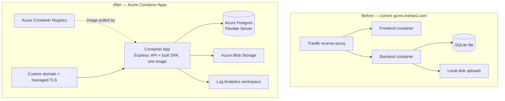

# GCMS — Azure Deployment & Migration Runbook

**Prepared:** 2026-09-11 | **Updated:** 2026-09-12 | **Branch:** `feature/pool-booking-system` | **Target:** Azure Container Apps

---

## 0. Purpose & Scope

This is a step-by-step operational runbook for taking GCMS from its current state — a
working application developed and tested locally, with an existing production
deployment at `gcms.mehaisi.com` on a separate server — and launching it officially on
Azure. Each step below explains **what** it does, **why** it's needed, and **how** to
verify it worked, not just the raw command.

**The existing `gcms.mehaisi.com` deployment is not touched by any of this.** It runs
from the repo root's `docker-compose.yml` + two-container setup (separate frontend and
backend containers behind Traefik) and keeps running throughout this migration. The
Azure path uses a **new, separate single-container `Dockerfile`** at the repo root,
built specifically for Azure Container Apps. Only once Azure is verified working do you
point DNS at it — until then, the old deployment is your safety net.

---

## 1. Current State Summary

| Area | Status |
|---|---|
| Application code | Feature-complete for this milestone: fleet (with Focal-Point→Department auto-sync), Pool status, handover (reordered workflow, deduplicated form, system-fetched serial/FA-code), maintenance, pool booking (with due-time reminders + FA extension-request/Admin-approval workflow), a full template-matched Incident Report form (fillable, PDF, Contracts/Maintenance escalation), a catalog-driven 3-level Warning Ticket system, reports, settings, and a restyled login page |
| Database | **PostgreSQL** in `prisma/schema.prisma`. Two migrations added 2026-09-12: `20260912173213_incident_form_and_ticket_fields` (Incident report-form fields + escalation flags) and `20260912173805_pool_booking_reminders_and_extensions` (reminder/overdue flags + extension-request fields on `PoolBookingRequest`) — both additive, no destructive changes, applied automatically by `prisma migrate deploy` in Step 5.5 |
| Backend build | `tsc --noEmit` clean (backend and frontend), 60/60 unit tests passing |
| Frontend build | `tsc --noEmit` clean, production build succeeds, `eslint` reports 0 errors (24 reviewed low-risk warnings remain) |
| Docker image | Written (`Dockerfile`, root of repo) — multi-stage build producing one image that serves both the API and the built React app |
| Storage driver | Abstracted — supports local disk, MinIO, or **Azure Blob Storage** behind one interface, selected via `STORAGE_DRIVER` env var |
| Email driver | Abstracted — supports SMTP relay or Resend, selected via `EMAIL_DRIVER` env var |
| Security hardening | helmet, environment-driven CORS, rate limiting (global + auth-specific), upload file-type validation, global input sanitization (DOMPurify) — all in place and verified |
| **Not yet done** | **Live verification on Azure.** The Docker build, the Postgres migration, the Azure Blob driver, and a real SMTP send have been written and code-reviewed but never run against real Azure infrastructure — the development sandbox has no Docker or Postgres available. Section 5 below is the first real end-to-end test. |

---

## 2. Why This Migration

- **Postgres over SQLite** — SQLite is a single file with no real concurrent-write
  story; a multi-venue tournament system with dozens of simultaneous field staff needs
  a real client-server database. Postgres also gets you point-in-time backup/restore
  on Azure, which a SQLite file does not.
- **One container instead of two** — the current production setup runs frontend and
  backend as separate containers behind Traefik. Azure Container Apps bills and scales
  per container app; folding the built React app into the same Express process that
  serves the API (`app.ts`'s static-file block, production-only) means one image, one
  running instance, one thing to scale and monitor, and no separate reverse-proxy
  config to maintain.
- **Azure Blob Storage over local disk / MinIO** — Container Apps instances are
  ephemeral; anything written to local disk disappears on redeploy or a scale event.
  Blob Storage is durable, has built-in backup (soft-delete + versioning), and needs no
  server of its own to run and patch.
- **Azure Container Apps over a plain VM** — it's a managed, serverless container
  platform: you give it an image, it handles scaling (including to zero, though this
  app should stay at `min-replicas 1`), TLS certificates for custom domains, and
  integrates directly with Azure Container Registry and Log Analytics for logs —
  meaningfully less to operate than a VM you patch yourself.

---

## 3. Architecture



The Azure side has four managed resources behind one Container App: **Postgres
Flexible Server** (the database), **Blob Storage** (photos, signatures, branding
assets), **Container Registry** (holds the built Docker image), and **Log Analytics**
(centralized logs, queryable, feeds any alerting you set up later).

---

## 4. Prerequisites

- [ ] An Azure subscription with permission to create resource groups and resources in it
- [ ] `az` CLI installed and `az login` run against the right subscription
      (`az account set --subscription <id>`)
- [ ] Docker installed on the machine doing the build-and-push step (Step 5.3) —
      **not required on this development machine**, only on whichever machine actually
      runs `docker build`
- [ ] DNS access for the domain you want GCMS to live at (e.g. `gcms.yourdomain.com`),
      to add a CNAME once the Container App exists
- [ ] An SMTP relay (Azure Communication Services, your O365 tenant, or similar) with
      credentials, if you want outgoing email to work at launch
- [ ] A strong password chosen in advance for the Postgres admin account (don't
      improvise this at the terminal — Postgres Flexible Server enforces complexity
      rules and you don't want a failed `az postgres flexible-server create` mid-run)

---

## 5. Step-by-Step Deployment

### Step 5.1 — Provision the Azure resources

**What:** Create the resource group and the four managed resources: Container
Registry, Postgres Flexible Server, Storage Account (+ a `gcms-uploads` blob
container), Log Analytics workspace, and the Container Apps Environment that ties them
together.

**Why:** Everything downstream (the app, its secrets, its scaling rules) attaches to
this environment. Creating it first means Step 5.2's `az containerapp create` has
somewhere to deploy into.

```bash
RG=gcms-rg
LOCATION=uaenorth       # pick the region closest to your users
ACR_NAME=gcmsacr$RANDOM
PG_NAME=gcms-pg-$RANDOM
STORAGE_NAME=gcmsstore$RANDOM
CAE_NAME=gcms-env

az group create -n $RG -l $LOCATION

# Container Registry — holds the Docker image Step 5.3 builds
az acr create -n $ACR_NAME -g $RG --sku Basic --admin-enabled true

# PostgreSQL Flexible Server — the production database
az postgres flexible-server create \
  -n $PG_NAME -g $RG -l $LOCATION \
  --admin-user gcms_admin --admin-password '<STRONG_PASSWORD>' \
  --sku-name Standard_B1ms --tier Burstable --version 16 \
  --storage-size 32 --public-access 0.0.0.0-255.255.255.255
  # ^ tighten this to Container Apps' outbound IPs, or use a private endpoint,
  #   before go-live — see the Go-Live Checklist, Section 8
az postgres flexible-server db create -s $PG_NAME -g $RG -d gcms

# Storage Account + Blob container — photos, signatures, branding assets
az storage account create -n $STORAGE_NAME -g $RG -l $LOCATION --sku Standard_LRS
az storage container create --account-name $STORAGE_NAME -n gcms-uploads

# Log Analytics + Container Apps Environment — logs + the environment the app lives in
az monitor log-analytics workspace create -g $RG -n gcms-logs
LOG_ID=$(az monitor log-analytics workspace show -g $RG -n gcms-logs --query customerId -o tsv)
LOG_KEY=$(az monitor log-analytics workspace get-shared-keys -g $RG -n gcms-logs --query primarySharedKey -o tsv)
az containerapp env create -n $CAE_NAME -g $RG -l $LOCATION \
  --logs-workspace-id $LOG_ID --logs-workspace-key $LOG_KEY
```

**Verify:** `az group show -n $RG` succeeds; `az postgres flexible-server list -g $RG -o table`
shows the new server as `Ready`.

---

### Step 5.2 — Configure secrets & environment variables

**What:** Create the Container App itself, wiring every environment variable the code
reads. Anything sensitive (database URL, JWT secrets, storage connection string, SMTP
password) goes in as a Container Apps **secret** and is referenced by name
(`secretref:...`) rather than appearing as a plain value — secrets are encrypted at
rest and never show up in `az containerapp show` output or logs.

**Why:** `backend/src/config/auth.ts` throws on boot in production if the JWT secrets
aren't set — there's no insecure fallback in production, by design. Getting every
variable right here is what makes Step 5.5 (first deploy) succeed instead of
crash-looping.

```bash
DB_URL="postgresql://gcms_admin:<STRONG_PASSWORD>@${PG_NAME}.postgres.database.azure.com:5432/gcms?sslmode=require"
STORAGE_CONN=$(az storage account show-connection-string --name $STORAGE_NAME -g $RG -o tsv)

az containerapp create \
  -n gcms -g $RG --environment $CAE_NAME \
  --image ${ACR_NAME}.azurecr.io/gcms:latest \
  --registry-server ${ACR_NAME}.azurecr.io \
  --target-port 3005 --ingress external \
  --min-replicas 1 --max-replicas 3 \
  --secrets \
    database-url="$DB_URL" \
    jwt-access-secret="$(openssl rand -base64 64)" \
    jwt-refresh-secret="$(openssl rand -base64 64)" \
    azure-storage-conn="$STORAGE_CONN" \
    smtp-pass='<YOUR_SMTP_PASSWORD>' \
  --env-vars \
    NODE_ENV=production \
    PORT=3005 \
    DATABASE_URL=secretref:database-url \
    JWT_ACCESS_SECRET=secretref:jwt-access-secret \
    JWT_REFRESH_SECRET=secretref:jwt-refresh-secret \
    JWT_EXPIRES_IN=7d \
    JWT_REFRESH_EXPIRES_IN=30d \
    CORS_ORIGIN=https://gcms.yourdomain.com \
    STORAGE_DRIVER=azure-blob \
    AZURE_STORAGE_CONNECTION_STRING=secretref:azure-storage-conn \
    AZURE_STORAGE_CONTAINER=gcms-uploads \
    EMAIL_DRIVER=smtp \
    SMTP_HOST=<your-relay-host> \
    SMTP_PORT=587 \
    SMTP_SECURE=false \
    SMTP_USER=<your-relay-user> \
    SMTP_PASS=secretref:smtp-pass \
    EMAIL_FROM="GCMS <noreply@yourdomain.com>" \
    LOG_LEVEL=info
```

> `az containerapp create` needs an image to already exist in ACR — do Step 5.3 first,
> then this command, or run this once to create the app shell and then
> `az containerapp update` with the same flags once the image is pushed.

**What each variable is for** (full reference table in the Appendix, Section 10):
`CORS_ORIGIN` must exactly match your production domain — a mismatch here is the #1
cause of a working API that the browser refuses to talk to. `STORAGE_DRIVER=azure-blob`
and `EMAIL_DRIVER=smtp` must be set explicitly — left unset, the code defaults to
local-disk storage and auto-detected email, neither of which is what you want in
production.

**Verify:** `az containerapp secret list -n gcms -g $RG -o table` lists all 5 secrets
(values hidden); `az containerapp show -n gcms -g $RG --query properties.template.containers[0].env`
shows every env var above.

---

### Step 5.3 — Build & push the Docker image

**What:** Build the root `Dockerfile` (multi-stage: builds the frontend, builds the
backend, copies both into a slim runtime image) and push it to the Container Registry
created in Step 5.1.

**Why:** Container Apps pulls images from a registry — it doesn't build from source.
This is the step that actually turns your code into the artifact Azure runs.

```bash
az acr login -n $ACR_NAME
docker build -t ${ACR_NAME}.azurecr.io/gcms:$(git rev-parse --short HEAD) -t ${ACR_NAME}.azurecr.io/gcms:latest .
docker push ${ACR_NAME}.azurecr.io/gcms --all-tags
```

**Verify:** `az acr repository show-tags -n $ACR_NAME --repository gcms -o table` lists
both tags you just pushed.

---

### Step 5.4 — Custom domain + managed TLS

**What:** Point your domain at the Container App and let Azure issue a managed TLS
certificate for it.

**Why:** Without this, the app is only reachable at the default
`*.azurecontainerapps.io` hostname over HTTPS with Azure's own cert — fine for testing,
not what you want to hand out as the production URL.

```bash
# First add a CNAME at your DNS provider pointing gcms.yourdomain.com at the app's
# default *.azurecontainerapps.io hostname (az containerapp show -n gcms -g $RG --query properties.configuration.ingress.fqdn)
az containerapp hostname add -n gcms -g $RG --hostname gcms.yourdomain.com
az containerapp hostname bind -n gcms -g $RG --hostname gcms.yourdomain.com --environment $CAE_NAME
```

**Verify:** `curl -I https://gcms.yourdomain.com/api/v1/health` returns `200` with a
valid certificate (no `-k` needed).

---

### Step 5.5 — First deploy: migrate, seed, rotate the default password

**What:** Run the Prisma migration against the real production database, seed the
first SuperAdmin account, then immediately change that account's password.

**Why:** The image has no dev dependencies (no `tsx`), so the seed script needs to run
either as a one-off Container Apps job against the same image, or from a machine with
network access to the database and the repo checked out. Either way, this is the step
that turns an empty database into one the app can actually log into — and the seeded
credentials (`superadmin@gcms.com` / `Admin@2024!`) are published in this repo's docs,
so leaving them unrotated is a real, immediate risk the moment the app is reachable.

```bash
az containerapp job create -n gcms-migrate -g $RG --environment $CAE_NAME \
  --image ${ACR_NAME}.azurecr.io/gcms:latest \
  --trigger-type Manual --replica-timeout 300 \
  --secrets database-url="$DB_URL" \
  --env-vars DATABASE_URL=secretref:database-url \
  --command "npx" --args "prisma,migrate,deploy" \
  --workdir /app

az containerapp job start -n gcms-migrate -g $RG
```

Seed the first SuperAdmin the same way (swap `--args` for the seed script, or run
`npx prisma db seed` from a machine with a network path to the database and the repo
checked out, pointed at `DATABASE_URL`). **Immediately log in and rotate the
`superadmin@gcms.com` password** — don't leave the default in place past first login.

**Verify:** `az containerapp job execution list -n gcms-migrate -g $RG -o table` shows
`Succeeded`; logging in at the app URL with the new password works.

---

### Step 5.6 — Verify health & readiness

**What:** Confirm both health endpoints return healthy before considering this live.

```bash
curl https://gcms.yourdomain.com/api/v1/health         # liveness — always 200 if the process is up
curl https://gcms.yourdomain.com/api/v1/health/ready    # readiness — checks DB + storage connectivity
```

**Why:** `/health` only proves the Node process is running — it says nothing about
whether it can actually reach Postgres or Blob Storage. `/health/ready` (added in this
project's Phase 7 hardening) checks both in parallel and returns `503` if either is
down, which is exactly the signal you want before routing real traffic here.

**Verify:** Both return `200` with `{"status":"ok", ...}`.

---

### Step 5.7 — Go live

**What:** With health checks green, a real login working, and a test email/notification
confirmed delivered, this is the point where you'd switch real users over — either by
updating DNS to point at Azure instead of the old server, or by announcing the new URL
if it's a fresh domain.

**Why last:** Everything before this step is reversible with zero user impact — nothing
has been pointed at Azure publicly yet except the domain you bound in Step 5.4, which
can point right back at the old server if something's wrong (see Section 9, Rollback).

---

## 6. Security & Code-Quality Audit Summary

Before this migration, a full-codebase review pass fixed:
- A real crash risk (a React Rules-of-Hooks violation on the public pool-booking page)
- ~10 places where API failures were silently swallowed instead of shown to the user
- **All 5 file-upload endpoints accepted any file type** — fixed with type-restricted
  upload filters (images-only / spreadsheet-only), closing a stored-content risk on the
  public storage proxy
- 29 frontend lint errors, down to 0
- A 443KB dashboard chunk (was bundling the whole charting library into the first page
  every user sees after login) — split into cacheable vendor chunks

And confirmed already sound: global input sanitization (DOMPurify) covering the app's
one raw-HTML render, JWT secrets that fail closed in production, auth rate-limiting,
no raw-SQL injection surface, and genuine role-based privilege-escalation guards (not
just route-level checks) in user management.

---

## 7. Known Follow-Ups / Risk Register

| Item | Risk if ignored | Recommended timing |
|---|---|---|
| `npm audit` reports 30 vulnerabilities (2 critical) in backend deps — could not run `npm audit fix` in the dev sandbox (an unrelated npm/arborist bug there) | Known CVEs in dependencies | Run `npm audit fix` in a normal environment **before** Step 5.3's build |
| `xlsx` package has no upstream fix (prototype pollution + ReDoS) | Affects fleet bulk-import and report exports | Monitor for an upstream fix; not blocking for launch |
| Storage proxy (`/api/v1/storage/...`) has no authentication — relies on unguessable filenames, not a real ACL | Someone with a leaked/guessed URL could view a signature or incident photo | Candidate for a follow-up hardening pass (cookie auth or signed URLs) |
| JSON-as-`String` Prisma columns (not converted to real `Json` type) | Cosmetic/maintainability only, not a functional risk | Low priority, own reviewed change |
| Docker build, Postgres migration, Azure Blob driver, real SMTP send — **never run against live infrastructure before this runbook** | Step 5 is the first real test of all of it | This is exactly what Section 5 is for — don't skip verification steps |

---

## 8. Go-Live Checklist

- [ ] All secrets set via `secretref:` (Step 5.2), not plain env vars
- [ ] `prisma migrate deploy` applied to the production database (Step 5.5)
- [ ] Seed SuperAdmin created **and its password rotated** (Step 5.5)
- [ ] `CORS_ORIGIN` matches the real production domain exactly
- [ ] Custom domain bound with managed TLS (Step 5.4)
- [ ] `GET /api/v1/health` and `GET /api/v1/health/ready` both return 200 (Step 5.6)
- [ ] `STORAGE_DRIVER=azure-blob` and `EMAIL_DRIVER=smtp` explicitly set
- [ ] A real email send through the SMTP relay succeeded (trigger a maintenance
      "Email report" or a warning notice and confirm delivery)
- [ ] Logs visible in the Log Analytics workspace
- [ ] `npm audit fix` run in a normal environment and reviewed (Section 7)
- [ ] Postgres public access tightened from `0.0.0.0-255.255.255.255` to Container
      Apps' actual outbound IPs, or moved to a private endpoint

---

## 9. Rollback Plan

Two independent safety nets:
1. **DNS-level:** until Step 5.7, `gcms.yourdomain.com` (or wherever you point it) is
   the only thing touching Azure publicly. If anything in Step 5 goes wrong, don't
   update DNS — the old `gcms.mehaisi.com` deployment keeps serving real users,
   completely unaffected.
2. **Revision-level (post-launch):** Container Apps keeps prior revisions.
   `az containerapp revision list -n gcms -g $RG -o table` then
   `az containerapp ingress traffic set -n gcms -g $RG --revision-weight <prior-revision>=100`
   shifts all traffic back to a known-good revision without a new deploy.

---

## 10. Appendix — Environment Variable Reference

| Variable | Required | Purpose |
|---|---|---|
| `NODE_ENV` | Yes | `production` — enables static-SPA serving, disables dev JWT fallback |
| `PORT` | Yes | `3005` — must match `--target-port` in Step 5.2 |
| `DATABASE_URL` | Yes | Postgres connection string, `sslmode=require` |
| `JWT_ACCESS_SECRET` / `JWT_REFRESH_SECRET` | Yes | Random secrets — app refuses to boot without them in production |
| `JWT_EXPIRES_IN` / `JWT_REFRESH_EXPIRES_IN` | No | Token lifetimes, default `7d` / `30d` |
| `CORS_ORIGIN` | Yes | Comma-separated list of allowed origins — must match your real domain |
| `STORAGE_DRIVER` | Yes in prod | `local` \| `minio` \| `azure-blob` — must be `azure-blob` for this deployment |
| `AZURE_STORAGE_CONNECTION_STRING` | Yes (if azure-blob) | From the storage account created in Step 5.1 |
| `AZURE_STORAGE_CONTAINER` | No | Defaults to `gcms-uploads` |
| `EMAIL_DRIVER` | Yes in prod | `smtp` \| `resend` — set explicitly, don't rely on auto-detect |
| `SMTP_HOST` / `SMTP_PORT` / `SMTP_SECURE` / `SMTP_USER` / `SMTP_PASS` | Yes (if smtp) | Your relay's connection details |
| `EMAIL_FROM` | No | Sender address shown to recipients |
| `LOG_LEVEL` | No | Defaults to `info` |
| `POOL_REMINDER_MINUTES_BEFORE` | No | Defaults to `30`. How long before a pool booking's return time the FA + Admin get a "due soon" notification (a one-time "overdue" notice fires once it passes). The in-process poller (`server.ts`, every 60s) is safe under `--max-replicas > 1` — each tick claims a row with a conditional `updateMany` before notifying, so only one replica ever sends a given reminder even with several replicas polling concurrently |

---

## Related documents
- `docs/deployment/azure-container-apps.md` (repo) — the terse command-reference
  version of this same guide, kept in sync with the codebase
- `docs/superpowers/specs/2026-09-09-gcms-pool-and-production-design.md` (repo) — the
  original design spec this migration implements
